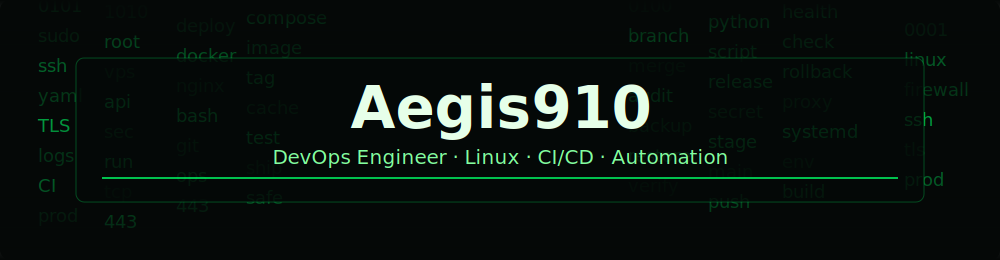

  

   
   

  
  
  
  
  
  

   
   

  

---

### Обо мне

DevOps Engineer, который работает на стыке Linux-инфраструктуры, контейнеризации, CI/CD и production-эксплуатации. Фокусируюсь на надежных релизах, понятной автоматизации, безопасной конфигурации серверов и предсказуемой работе сервисов.

- 🧭 Основной фокус: Linux, Docker, Nginx, GitHub Actions и надежный деплой
- 🛠️ Проектирую процессы так, чтобы релизы были повторяемыми, проверяемыми и откатываемыми
- 🔐 Уделяю внимание доступам, secrets, TLS, базовой безопасности и валидации окружений
- 📈 Развиваюсь в Kubernetes, Terraform, Ansible, observability и production operations
- 🧩 Люблю разбирать сложные системы до понятных, поддерживаемых компонентов
- 🤝 Открыт к сильным инженерным задачам, инфраструктурным проектам и DevOps-практикам

---

### Опыт

**DevOps Engineer**

Проектирую и поддерживаю рабочие процессы доставки приложений: от подготовки серверов и контейнеризации до автоматического деплоя, rollback-сценариев, TLS, secrets management, health checks и post-deploy validation.

- Linux-серверы на Ubuntu/Debian: SSH, firewall, systemd, пользователи, права, базовая hardening-конфигурация
- Docker/Docker Compose для backend, frontend и microservices-проектов
- Nginx reverse proxy, домены, HTTPS, Let's Encrypt, redirects и server validation
- GitHub Actions: build, test, deploy, rollback, backup/restore и multi-environment delivery
- Управление dev/staging/production окружениями, `.env`, secrets и конфигурациями
- Диагностика инцидентов через логи приложений, контейнеров, Nginx и системных сервисов
- Bash/Python automation для безопасных релизов, проверок и повторяемых операций

**Ключевой результат:** участие в построении production-ready CI/CD процесса с автоматизацией релизов, откатов, секретов, TLS, проверок серверов и post-deploy контроля.

---

<strong>🛠️ Инструменты</strong>

<strong>👨‍💻 Языки и скриптинг</strong>

  
  
  
  
  
  

<strong>🧱 Инфраструктура и ОС</strong>

  
  
  
  
  
  
  
  
  

<strong>🚀 DevOps и доставка</strong>

  
  
  
  
  
  
  
  
  
  
  
  
  
  

<strong>🗄️ Базы, мониторинг и платформы</strong>

  
  
  
  
  
  
  
  
  
  
  
  
  

<strong>🧰 Софт и утилиты</strong>

  
  
  
  
  
  
  

---

### Движение вперед

  

