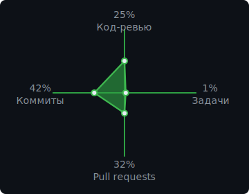

<div align="center">

  

  <br />

  
  <a href="#">
    
  </a>
  <a href="#">
    
  </a>
  <a href="#">
    
  </a>

  <br />
  <br />

  

</div>

---

### Обо мне

- DevOps-инженер + ведущий системный администратор
- Интересуюсь Linux, инфраструктурой, автоматизацией и надежными системами
- С детства активно увлекаюсь играми
- Люблю high-tech, инженерный подход и науку
- Прокачиваю DevOps-навыки на практике и через реальные задачи

---

### Опыт

**DevOps-инженер + ведущий системный администратор**  
`Июнь 2025 — сейчас`

Занимаюсь администрированием Linux-серверов, деплоем приложений на VPS, настройкой Docker/Docker Compose, Nginx reverse proxy, SSL/TLS, CI/CD в GitHub Actions и сопровождением dev/staging/production окружений.

**Что делаю:**

- Администрирую Ubuntu/Debian серверы: пользователи, права доступа, SSH, firewall, systemd и базовая безопасность
- Разворачиваю и сопровождаю backend/frontend/microservices-проекты в Docker и Docker Compose
- Настраиваю Nginx, домены, HTTPS, Let's Encrypt, редиректы и reverse proxy
- Поддерживаю CI/CD pipelines в GitHub Actions: сборка, тестирование, деплой, rollback и post-deploy проверки
- Работаю с Git/GitHub: branches, pull requests, tags, releases и откаты деплоев
- Анализирую логи приложений, Docker-контейнеров, Nginx и системных сервисов
- Настраиваю переменные окружения, secrets, health checks и базовый мониторинг

**Достижение:** участвовал в построении production-ready CI/CD процесса для приложений и сервисов: автоматизация деплоя, rollback, backup/restore, secrets management, TLS, server validation и post-deploy проверки. Основной вклад — GitHub Actions workflows и Bash/Python scripts для безопасных релизов в несколько окружений и регионов.

---

### Технологии

<div align="center">

  

</div>

<br />

<div align="center">

  
  
  
  
  
  
  
  
  
  
  
  
  
  

</div>

### Средний уровень

<div align="center">

  
  
  
  
  
  
  
  
  

</div>

---

### Прогресс

| Направления | Движение |
|:-:|:-:|
| **Python**<br>**Linux**<br>**DevOps**<br>**Автоматизация** |  |

---

### Сейчас в фокусе

```text
Системы       Linux, серверы, процессы, сети
DevOps        Docker, CI/CD, деплой, наблюдаемость
Автоматизация Bash, Python, повторяемые процессы
Рост          Чистые конфиги, безопасные релизы, инженерные привычки
```

---

### Активность

<div align="center">

  

  <br />
  <br />

  
  

  <br />
  <br />

  

</div>

---

### LeetCode

<div align="center">

  <a href="#">
    
  </a>

</div>

---

### Контакты

<div align="center">

  <a href="#">
    
  </a>
  <a href="#">
    
  </a>
  <a href="https://github.com/Aegis910">
    
  </a>

</div>

---

<div align="center">

  <sub>Спасибо, что заглянул. Держим системы чистыми, логи читаемыми, а деплой спокойным.</sub>

</div>
